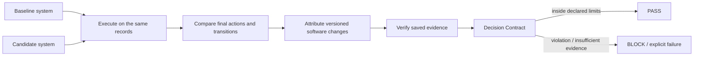

# DeciShift

[](https://github.com/sauravsingla/DeciShift/actions/workflows/tests.yml)
[](https://pypi.org/project/decishift/0.3.1/)
[](https://pypi.org/project/decishift/0.3.1/)
[](LICENSE)

**Explain why final decisions changed between versions of an ML decision system.**

DeciShift is an **open-source ML behavioral regression testing and decision-change analysis framework**. It replays a baseline and candidate decision system on the same historical records, identifies record-level action transitions, attributes changes to versioned software components, preserves verifiable evidence, and can turn declared limits into a deterministic release gate.

Git tells you **which code changed**. Model evaluation tells you **whether model metrics changed**. DeciShift focuses on **which final operational decisions changed and how those changes map back to the executable system**.



DeciShift is CPU-first, local-first, offline-capable, and framework-agnostic. Core operation requires no GPU, cloud service, database, Docker runtime, model registry, hosted dashboard, LLM/API, or telemetry service.

## Where it helps

| Situation | Aggregate view | Decision-level question DeciShift adds |
|---|---|---|
| Candidate accuracy/AUC improves | Looks better overall | Which individual operational actions still changed? |
| A threshold or policy changes | Model may be identical | Which action transitions were introduced by policy behavior? |
| A downstream rule changes | Model metrics may be unchanged | Which records moved because the executable decision layer changed? |
| Global change is acceptable | Overall shift stays below a limit | Does a governed cohort exceed its own declared limit? |

DeciShift complements experiment trackers, model registries, evaluation/monitoring systems, orchestration, and CI/CD rather than replacing them. See [related categories and the information matrix](docs/comparisons.md).

## Public-data result: why decision-level regression matters

The repository includes a machine-generated case study using the public scikit-learn **Digits** dataset with a trained XGBoost model and three downstream actions: `auto_not_8`, `manual_review`, and `auto_8`.

On a fixed held-out split of **719 records**:

| Measure | Baseline | Candidate |
|---|---:|---:|
| Model accuracy | 90.26% | **91.79%** |
| ROC AUC | 0.9429 | **0.9472** |
| `auto_8` actions | 66 | 74 |
| `auto_not_8` actions | 530 | 526 |
| `manual_review` actions | 123 | 119 |

Despite the improved model metrics and a similar aggregate action mix, **30 of 719 actions changed (4.17%)**:

| Transition | Records |
|---|---:|
| `auto_not_8 → manual_review` | 13 |
| `manual_review → auto_8` | 8 |
| `manual_review → auto_not_8` | 9 |

Exact software-counterfactual attribution over the changed nodes assigned **48.86%** absolute attribution share to the model, **46.59%** to policy, and **4.55%** to rules. The global Decision Contract passed its 5% action-shift limit, but the `actual_digit=6` cohort shifted **9.41%**, above its declared 8% limit, so the contract returned **BLOCK**.

That is the core gap DeciShift is built to expose:

> **model metric improves → aggregate action mix looks similar → individual actions still move → transitions are identified → versioned software changes are attributed → governed limits can block release**

The figures are tied to the committed machine-generated snapshot for source commit [`76bbf63abb7fdbba26739f3c8f96f94e0110bfc8`](docs/case-studies/digits-xgboost-76bbf63abb7fdbba26739f3c8f96f94e0110bfc8.md). They are descriptive evidence over this public evaluation split, not a claim of production safety, fairness, compliance, or real-world causality.

## Quick start

Current release: **v0.3.1 — Trust and evaluation hardening**.

```bash
python -m pip install --upgrade decishift==0.3.1
decishift demo --rows 1000 --no-save
```

From a source checkout, run the complete DecisionFlow trust path:

```bash
python -m pip install -e ".[dev]"
decishift graph examples/triage/flow.yaml
decishift compare examples/triage/flow.yaml
# copy the emitted Run ID
decishift verify RUN_ID
decishift gate RUN_ID --contract examples/triage/decision-contract.yaml
```

The bundled 60-second run demonstrates the same `graph → compare → verify → gate` path:


A contract pass means only that observed evidence stayed inside user-declared limits; it is not proof that a candidate is safer, better, fairer, compliant, or correct.

## Python API in one small example

```python
import numpy as np
import pandas as pd

from decishift import DecisionFlow, DecisionNode, compare_flows

records = pd.DataFrame({
    "id": [1, 2, 3],
    "score": [0.55, 0.76, 0.91],
})


def score(frame):
    return frame["score"].to_numpy()


def baseline_policy(frame, inputs):
    return np.where(inputs["score"] >= 0.80, "auto", "review")


def candidate_policy(frame, inputs):
    return np.where(inputs["score"] >= 0.70, "auto", "review")


baseline = DecisionFlow(
    nodes=[
        DecisionNode("score", score, version="score-v1"),
        DecisionNode("action", baseline_policy, depends_on=("score",), version="policy-v1"),
    ],
    final_node="action",
)

candidate = DecisionFlow(
    nodes=[
        DecisionNode("score", score, version="score-v1"),
        DecisionNode("action", candidate_policy, depends_on=("score",), version="policy-v2"),
    ],
    final_node="action",
)

result = compare_flows(baseline, candidate, records, id_column="id")
print(result.summary()["transition_counts"])
```

Components can expose `run(records, inputs)` or be compatible local callables. Every node output remains aligned to the same records; pandas index reordering is rejected.

## DecisionFlow model

`DecisionPipeline` remains the backwards-compatible fixed binary path:

```text
features -> model -> calibrator -> threshold -> rules -> binary decision
```

`DecisionFlow` is the structured row-aligned DAG path:

```text
features
├── risk_model ──┐
└── value_model ─┼── policy -> rules -> action
```

It supports branching, merging, multiple models/policies/rules, and categorical actions without becoming a generic workflow engine. Topology changes may still be compared as complete baseline/candidate executions, but hybrid attribution is reported as unsupported when the node graph is incompatible rather than fabricating a substitution graph.

## What the comparison produces

A DecisionFlow comparison can include:

- record-level baseline/candidate actions and explicit transitions;
- action distributions and transition matrices;
- changed node/component identities;
- structural downstream reachability;
- exact or sampled **software-counterfactual attribution**;
- pairwise interactions;
- cohort action-shift summaries;
- optional outcomes and explicit-margin fragility;
- graph-aware cache diagnostics;
- saved evidence with a SHA-256 integrity root;
- deterministic Decision Contract results.

Categorical actions are never numerically subtracted or silently ordinal-encoded. Software-counterfactual attribution does **not** establish real-world causal effects.

## Evidence and release gating

Saved DecisionFlow runs use evidence schema `2.0`; supported older DecisionPipeline evidence remains readable.

```bash
decishift verify RUN_ID
decishift gate RUN_ID --contract examples/triage/decision-contract.yaml
```

Verification is a **tamper-evident integrity check** over the manifest and declared artifacts. It does not authenticate a signer, prove source-data truth, or establish organizational trust.

Decision Contract exit codes are automation-friendly:

| Outcome | Exit code |
|---|---:|
| pass | `0` |
| usage/config error | `2` |
| contract violation | `10` |
| insufficient evidence | `11` |
| integrity failure | `12` |

See [failure modes](docs/failure-modes.md) for negative-path behavior.

## Compatibility

| Area | Verification |
|---|---|
| Python | 3.11, 3.12, 3.13 |
| Linux | full unit/integration/coverage/build matrix |
| macOS | core smoke path on Python 3.11 |
| Windows | core smoke path on Python 3.11 |
| Core dependencies | NumPy `>=1.24`, pandas `>=2.0`, PyYAML `>=6.0`, Typer `>=0.26.0` |
| Optional adapters | scikit-learn `>=1.3`, XGBoost `>=2.0`, LightGBM `>=4.0` |
| Runtime model | CPU-first, local/offline core |

The optional ML libraries have their own CI jobs; core macOS/Windows smoke coverage does not imply every optional library/version is validated on those operating systems. See the full [compatibility matrix](docs/compatibility.md).

## Public examples and reproducible benchmarks

The repository includes three complementary examples:

- [`examples/triage/`](examples/triage/) — fully bundled synthetic equipment-maintenance DecisionFlow;
- [`examples/public_wine_sklearn/`](examples/public_wine_sklearn/) — public Wine data with a trained scikit-learn model;
- [`examples/public_digits_xgboost/`](examples/public_digits_xgboost/) — public Digits data with a trained XGBoost model and the case study summarized above.

Benchmarks are machine-generated and tied to source commits:

```bash
python benchmarks/benchmark_cpu.py
python benchmarks/benchmark_flow_cpu.py
python benchmarks/evaluate_flow_attribution.py \
  --json-out evaluation-artifacts/flow-benchmark.json \
  --markdown-out evaluation-artifacts/flow-benchmark.md
```

The first committed flow-attribution snapshot is [`benchmarks/results/76bbf63abb7fdbba26739f3c8f96f94e0110bfc8.md`](benchmarks/results/76bbf63abb7fdbba26739f3c8f96f94e0110bfc8.md). Its bounded sampled runs did **not** meet the configured CI-width convergence target; that negative result is retained as measured rather than tuned away.

## Quality gates

Normal CI covers Python 3.11–3.13, declared minimum runtime dependencies, property/golden tests, package build validation, the complete DecisionFlow trust path, and dedicated scikit-learn/XGBoost/LightGBM examples. Core smoke tests also run on macOS and Windows.

The repository additionally maintains:

- a stricter per-module coverage gate for trust-critical evidence/attribution code;
- targeted mypy checks while typing is expanded incrementally;
- generated API-reference drift detection;
- scheduled/manual mutation testing for trust-critical evidence/action logic;
- release SBOM generation and build-provenance attestations where GitHub supports them.

## Documentation

- [Getting started](docs/getting-started.md)
- [Architecture](docs/architecture.md)
- [Decision flows](docs/decision-flows.md)
- [Flow attribution](docs/flow-attribution.md)
- [Decision Contracts](docs/decision-contracts.md)
- [Evidence integrity](docs/evidence-integrity.md)
- [Evaluation study](docs/evaluation-study.md)
- [Public API reference](docs/api-reference.md)
- [Compatibility](docs/compatibility.md)
- [Failure modes](docs/failure-modes.md)
- [Related categories](docs/comparisons.md)
- [Roadmap](ROADMAP.md)
- [Contributing](CONTRIBUTING.md) and [Support](SUPPORT.md)

## Research positioning and limits

DeciShift is related to behavioral/model regression testing, slice analysis, ML monitoring, Shapley attribution, unit-change attribution, and CI release gates. It does **not** claim that Shapley attribution is novel. Its specific object of analysis is the **decision/action transition produced by a versioned structured executable decision system**.

Important limits:

- results depend on the supplied historical records;
- structural reachability is not causal impact;
- software-counterfactual attribution does not establish real-world causality;
- sampling intervals quantify permutation-sampling uncertainty only;
- integrity verification does not establish evidence authenticity or signer identity;
- public benchmark datasets are evaluation evidence, not proof of production deployment fitness.

## Release, license, and citation

Current release: **v0.3.1 — Trust and evaluation hardening**.

- GitHub release: https://github.com/sauravsingla/DeciShift/releases/tag/v0.3.1
- PyPI: https://pypi.org/project/decishift/0.3.1/
- License: [Apache-2.0](LICENSE)
- Citation metadata: [`CITATION.cff`](CITATION.cff)

The v0.3.1 Zenodo DOI is intentionally not predeclared. If a new Zenodo archive is minted, citation metadata should be updated to the DOI actually assigned to that archived version.
